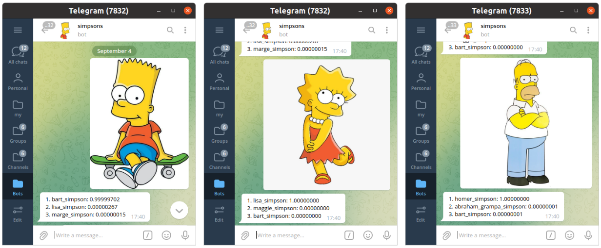

### DLS1_SIMPSONS [:link:](https://stepik.org/course/101721/syllabus)

* model: [EfficientNet](https://github.com/lukemelas/EfficientNet-PyTorch) trained on [journey-springfield](https://www.kaggle.com/c/journey-springfield/data)
* deployment: vm instance on [oracle cloud](https://www.oracle.com/cloud)
* demo: https://t.me/vaaliferov_simpsons_bot

